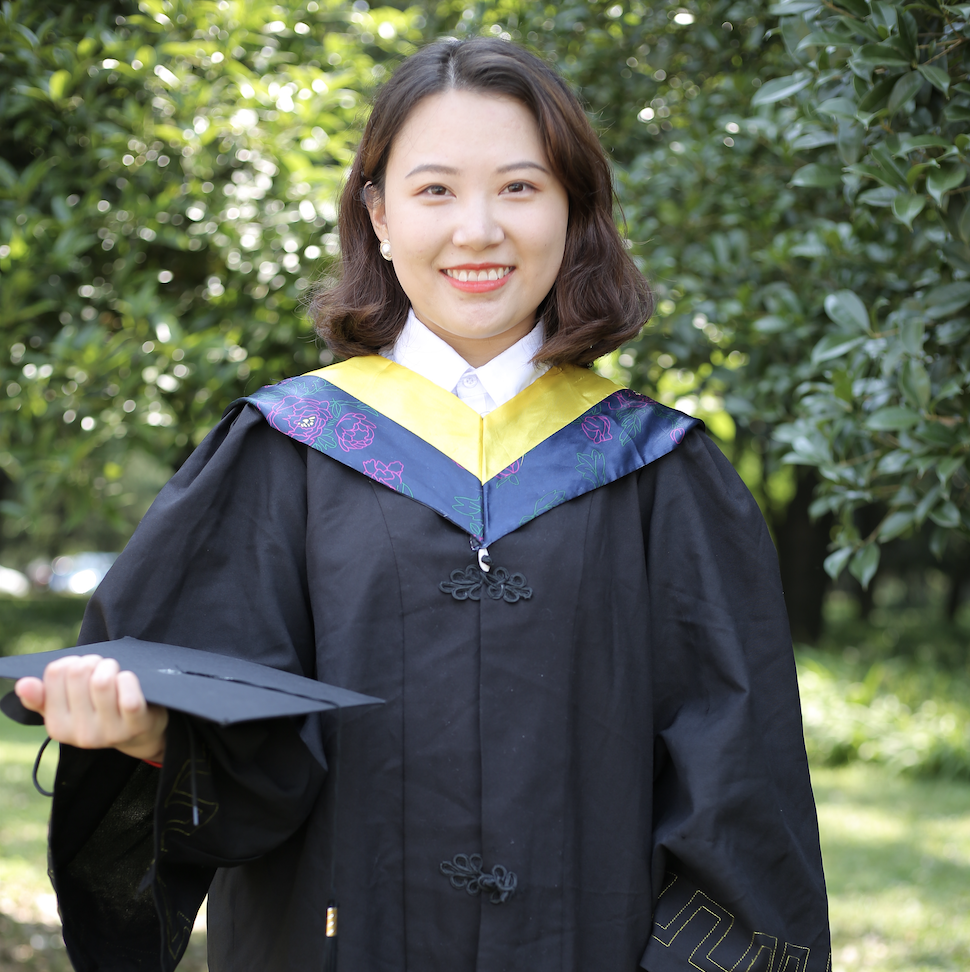

  

    

      
      
      
    

  

  
 
    

      <b>Wei CHEN</b>
        
      MPhil Student at CSE (since Fall 2019)
         E-mail: wchenbt [at] cse [dot] ust [dot] hk
         Office: Lift 31, Room 3664, Academic Building
         Hong Kong University of Science and Technology
      
    

  

---

  <b>Biography</b>
   
   I am currently a MPhil year 2 student at <a href="http://www.cse.ust.hk/">Department of Computer Science and Engineering</a>, <a href="https://www.ust.hk/">Hong Kong University of Science and Technology</a>, supervised by <a href="https://home.cse.ust.hk/~shuaiw/">Prof. Shuai Wang</a>.
   
   Before joining HKUST, I received my B.E. degree from <a href="http://www.cs.hust.edu.cn/">Department of Computer Science and Technology</a>, <a href="http://www.hust.edu.cn/">Huazhong University of Science and Technology</a>, Wuhan, China in 2019.
   
   My research interests include software and system security.

---

  <b>Selected Experiences</b>
  <li><b>Research Intern @ The University of Hong Kong</b>, supervised by <a href="https://i.cs.hku.hk/~smyiu/cv-SMYiu-Apr2016.pdf">Prof. S.M. Yiu</a>, 2018</li>
  <li><b>Software Engineer Intern @ Tencent</b>, Android Runtime Hook Software Development Kit, 2017</li>

---

  <b>Selected Awards</b>
  <li>Postgraduate studentship, Hong Kong University of Science and Technology, 2019-present</li>
  <li>Excellent graduate of Huazhong University of Science and Technology, 2019</li>
  <li>National Scholarship, Huazhong University of Science and Technology, 2017 </li>
  <li>Outstanding Student of  Huazhong University of Science and Technology, 2016, 2017, 2018 </li>

----

  <b>Professional Service</b>
    <li><b>Conference reviewer</b>, ICICS 2019, <a href="https://conf.researchr.org/home/icse-2020">ICSE 2020</a>, <a href="https://asiaccs2021.comp.polyu.edu.hk/">AsiaCCS'21</a></li>
  <li><b>Conference reviewer</b>, Artifact evaluation trace,  <a href="https://2019.icse-conferences.org/">ICSE 2019</a>, <a href="https://conf.researchr.org/home/icse-2020">ICSE 2020</a>, <a href="https://www.usenix.org/conference/usenixsecurity20">USENIX 2020</a>

---

  <b>Teaching</b>
    <li>Computer Organization (COMP 2611), String 2021</li>
    <li>Operating Systems (COMP 3511), Fall 2020</li>

 Link to <a href="https://zhangshurong.github.io/">My Boyfriend</a>, <b>Development Engineer @ Tencent</b>

© Last Updated: Jan 2021

